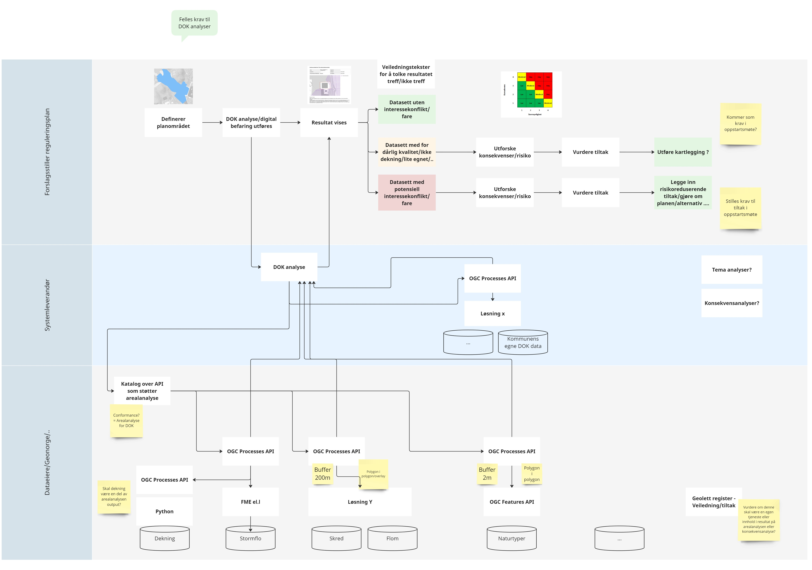

# Arealanalyser
Prosjektet startet opp under [tiltak 50 - Arealanalyser](https://www.geonorge.no/Geodataarbeid/nasjonal-geodatastrategi/handlingsplanens-tiltak/tiltak-50/) i nasjonal geodatastrategi sin handlingsplan og er nå videreført under [tiltak 3 - Heve kvaliteten på det offentlige kartgrunnlaget(DOK)](https://www.geonorge.no/Geodataarbeid/nasjonal-geodatastrategi/handlingsplanens-tiltak/tiltak-3/) og [aktivitet 2 - DOK arealanalyse](https://tiltaksplan.geonorge.no/tiltak/3/aktivitet/2).

Prosjektmål:
* Beskrive en standardisert DOK-arealanalyse med mål å få mer enhetlig DOK-analyse på tvers av kommuner og systemleverandører
    * rammeverk for hvordan spesifisere
    * spesifisere DOK-analyse på faglig nivå
    * spesifisere - teknisk nivå
* Gå fra analyser innbakt i fagetatenes egne kartløsninger til å tilby løsninger/API for å integrere i brukerløsninger  - ulike aktører selv implementere analysen
    * å teste gjennom å implementere pilot/MVP

## KS veikart
Tilknytning til T-2.5 Utvikle krav til felles DOK-analyse i [KS sitt veikart for plan, bygg og geodata](https://www.ks.no/globalassets/fagomrader/digitalisering/verktoykasse-plan--og-byggesaker/gjennomfore/18-08-22-Veikart-plan-bygg-og-geodata-Sluttrapport-v1-0-ny-struktur.pdf).
Tiltaket har som formål å etablere det vi kan kalle en «standardisert
områdeanalyse». Dette betyr å legge til rette for standardiserte DOKanalyser som analyserer alle DOK-datasett som er relevante for en gitt
tiltakstype, og presenterer den informasjonen som er relevant å
hensynta for en gitt eiendom/planområde på en enkel og forståelig
måte.
Tiltaket må sees i sammenheng med tiltak 2.3 Gode og tilgjengelige
DOK-datasett.

Nasjonale retningslinjer for DOK-analyse vil bidra til at relevante
DOK-data blir lettere tilgjengelige og mer standardiserte på tvers av
prosjekter og kommuner. En strukturert og enhetlig presentasjon av
dataene vil bidra til at næringsliv, innbyggere og saksbehandlere i
større grad kan være selvbetjente.
Standardisering av DOK-analysene vil sørge for at analysene får en
enhetlig form, med kvalitetssikrede datasett.

For KS vil DOK-arealanalyser bidra med en teknisk spesifikasjon som kan brukes som krav i [Nasjonal produktspesifikasjon for plan- og byggesak](https://www.ks.no/fagomrader/digitalisering/felleslosninger/verktoykasse-plan--og-byggesak/verktoy/nasjonal-produktspesifikasjon-plan--og-byggesak/)

## Geolett
Prosjektet kobles til resultatene fra Geolett 1 og vil bruke veiledningstekster og tjenester som er lagt inn i [geolett register](https://register.geonorge.no/geolett). Dette videreføres i Geolett 2 som følger opp med overordnede mål:
* plan og byggesaksprosessen skal oppleves som sammenhengende og helhetlig for brukerne uansett hvilken kommune eller sektormyndighet som er involvert. Dette gjelder brukergrupper som omfatter både innbyggere, næringsliv, frivillige organisasjoner og offentlige virksomheter
* brukerne skal unngå å måtte oppgi relevant informasjon i plan- og byggesaksprosessen som sektormyndigheter og kommuner allerede har innhentet
* sektormyndighetene skal dele data som ikke er skjermet på en form som er egnet for digital selvbetjening og som er egnet for viderebruk i nye tjenester som skaper verdiskaping i næringslivet
* det skal utvikles metodikk, prinsipper og rammeverk som støtter datadeling på tvers av sektormyndigheter og på den måten skapes et felles økosystem for nasjonal digital samhandling innen plan- og byggesaksområdet
* det skal utvikles sammenhengende tjenester på tvers av sektorer og forvaltningsnivåer som ivaretar både kommunale og statlige behov

For Geolett 2 vil DOK-arealanalyser kunne bidra til en standard måte å levere DOK-arealanalyser på fra feks sektormyndigheter. 

## Teknologisk rammeverk for den geografiske infrastrukturen
DOK Arealanalyser ligger under [Prosesseringstjenester i teknologisk rammeverk](https://dokument.geonorge.no/styrendedokumenter/nasjonalt-rammeverk-for-geografisk-informasjon/rammeverksdokumentet/teknologisk-rammeverk-for-den-geografiske-infrastrukturen/4.0/teknologiskrammeverkhtml.html#_prosesseringstjenester) og anbefaling 83 er relevant å kunne støtte i DOK arealanalyser.

83. Ofte brukte analyser av høy samfunnsmessig betydning bør implementeres som tjenester og dokumenteres i Geonorge, slik at en unngår å måtte laste ned hele databaser samt sikre at en bruker oppdaterte data som utgangspunkt for analyser. Dataeier bør tilby analysetjenester (WPS) som f.eks om tiltak berører eller er i nærheten av data som inngår i de datasett som kommunen har bekreftet inngår i DOK. Det er dataeier som har best kunnskap om sine data og bruken av disse i tjenestene.
Eksempler på analyse:
* Avstand til kvikkleire
* Avstand fra 50 års flom/100 års flom
* Avstand fra kulturminner
* Berører antikvariske bygg

## DOK-Arealanalyse spesifikasjon
Dette er utkast/forslag til standard for DOK-arealanalyse. 

### Skisser til TO BE arkitektur

### Teknisk dokumentasjon - OGC Processes API
Se [Spesifikasjon](spec.md)

### Demonstrator
En demonstrator/POC for å teste ut API for DOK arealanalyser er tilgjengelig på https://dok-arealanalyse.azurewebsites.net/.

Her er eksempler på områder som kan brukes som analyseområde i demonstrator:
* [Stormflo skien havn](demonstrator/stormflo_havn.geojson)
* [Arealplan His allè i Arendal](demonstrator/arealplan_his-alle.geojson)
* [Flom i drammen](demonstrator/flom_drammen.geojson)

### Liste over avklaringer legges under Issues